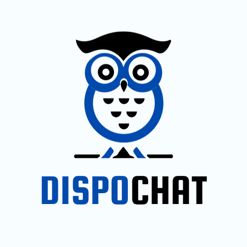

  
<h1 align="center">DispoChat</h1>
<strong><i>A Disposable chatroom website which doesn't collect ant data</i></strong>
 
 

---

# Features

- Don't Collect Any Data
- No Login or Signup required to procees.
- Easy to create chatroom and Delete Them.
- Invite Friends.
- No Limit of usage

---
